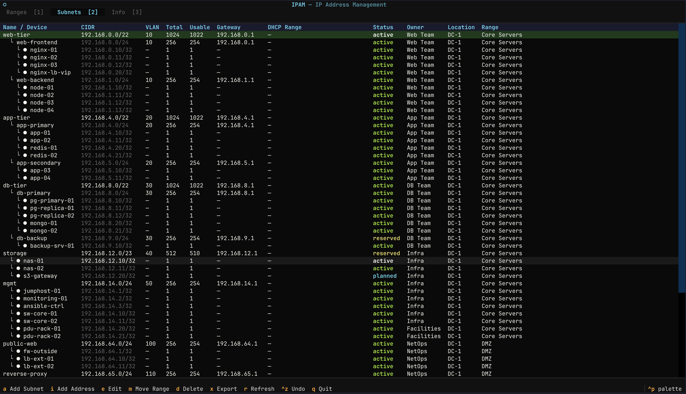
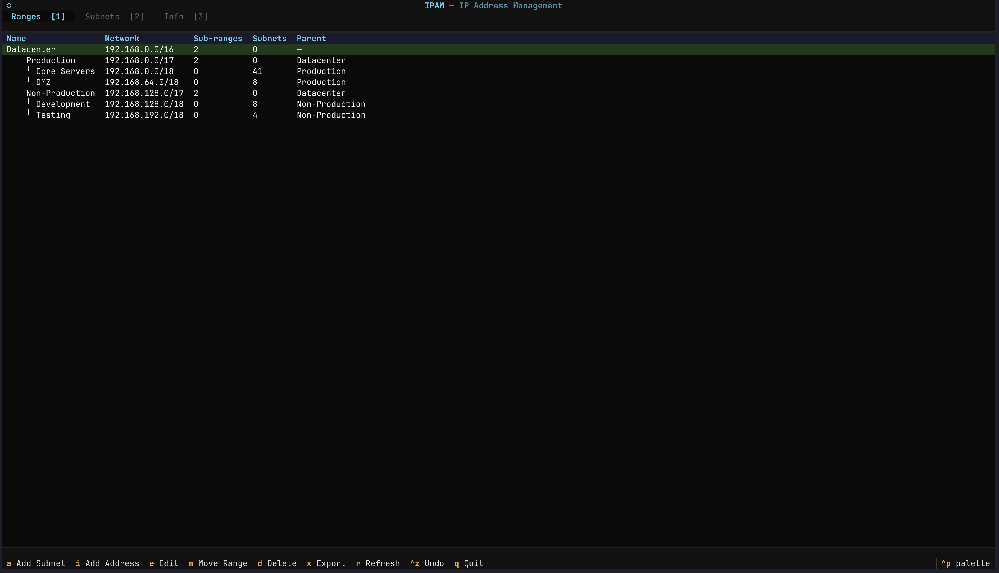
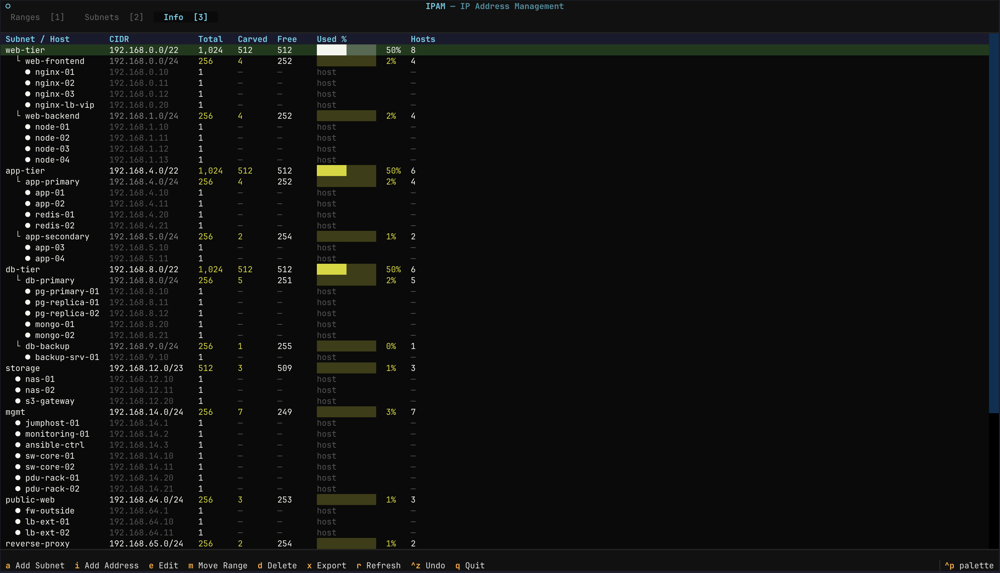

# ipamtool

A terminal-based IP Address Management (IPAM) tool for network planning. Define IP ranges, carve out subnets at any depth, track host addresses, and export to Excel or CSV — all from the keyboard.


---

## Screenshots


*Subnets tab — subnets grouped under collapsible folder headers. Enter to expand/collapse. Device lists collapse to a single row.*


*Folders tab — shows only the root range with rolled-up sub-folder and subnet counts.*


*Info tab — utilization stats grouped by folder. Hosts are aggregated into the Hosts column.*

---

## Concepts

### Folders vs Subnets

The tool uses two distinct concepts that are visually differentiated everywhere:

| Type | What it is | Shown as |
|---|---|---|
| **Folder** (Range) | An administrative container — organises subnets into groups. Has a CIDR that acts as a fence. | `▼ folder` in TUI · `folder` label in CLI |
| **Subnet** | An actual routed network with a gateway, VLAN, status, and owner. | `subnet` / `host` label |

Folders live in the **Ranges** tab and as collapsible headers in the **Subnets** tab. Subnets live under folders. The CIDR of a folder just defines the address space that folder manages — it is not a route.

### Naming Convention

Subnet names include their full folder path as a prefix, starting from the root range slug:

```
corp-dc-srv-app   →  corp  (root) · dc (Datacenter) · srv (Servers) · app (App subnet)
```

When you add a subnet, the tool auto-fills the name field with the parent's name as a prefix. You only need to append the specific identifier.

---

## Features

- **Interactive TUI** — keyboard-driven terminal interface built with [Textual](https://github.com/Textualize/textual)
- **Folders and subnets** — ranges act as collapsible folders in the subnets view; folders and subnets are clearly labelled throughout
- **Hierarchical ranges** — nest folders inside folders to any depth
- **Hierarchical subnets** — nest subnets inside subnets to any depth
- **Auto-prefix naming** — adding a subnet under `corp-dc-srv` pre-fills the name as `corp-dc-srv-`
- **Host address tracking** — register specific `/32` addresses with a device name
- **Smart allocation** — auto-assigns the next free block; if the natural boundary conflicts, finds the first available slot and tells you how many children will relocate
- **Cascade deletes** — deleting a range removes all its child ranges and subnets; deleting a subnet removes all descendants; the confirmation prompt shows the full cascade count before anything is touched
- **Child cascade** — resizing or moving a parent updates all descendants: addresses, `parent_subnet` refs, and gateways
- **128-step undo** — every change is snapshotted; `ctrl+z` in the TUI or `ipam undo` on the CLI; undo history is gzip-compressed so large datasets stay compact
- **Session locking** — the TUI acquires an exclusive lock on the data directory at startup; a warning is shown if a second session opens the same directory
- **Input validation** — gateway and DHCP addresses are validated as IPv4 before saving; unnormalised CIDRs (host bits set) are corrected with a notification; IPv6 input is rejected with a clear message
- **Usage statistics** — carved / free / used % per subnet, colour-coded by pressure
- **Export** — styled `.xlsx` with colour-coded status rows, frozen header, and hierarchical indentation; plain `.csv` also available
- **Persistent storage** — plain CSV files at `~/.ipam/`, readable in any spreadsheet

> **IPv4 only.** All addresses and networks must be IPv4. IPv6 input is rejected at every entry point.

---

## Tracked Fields

| Field | Description |
|---|---|
| Segment Name | Human-readable name |
| Device Name | Host identifier for `/32` addresses |
| VLAN ID | VLAN number |
| Purpose | What this subnet is used for |
| Subnet | Network address |
| CIDR | Prefix length |
| Gateway | Default gateway (auto-assigned or manual) |
| DHCP Start / End | DHCP range (optional, auto-calculated) |
| Static Range | Description of static IP allocations |
| Location | Physical or logical location |
| Owner | Team or person responsible |
| Status | `active`, `reserved`, `planned`, or `deprecated` |
| Notes | Free-text notes |
| Parent Range | Which registered range this subnet belongs to |
| Parent Subnet | Parent subnet for nested subnets |

---

## Installation

**Requires Python 3.11+**

### Recommended: pipx

[pipx](https://pipx.pypa.io) installs the tool in an isolated environment and makes the `ipam` command available globally.

```bash
brew install pipx
pipx ensurepath
pipx install git+https://github.com/TheCheeseTown/ipamtool.git
```

To update:

```bash
pipx reinstall ipamtool
```

### From source

```bash
git clone https://github.com/TheCheeseTown/ipamtool.git
cd ipamtool
pipx install .
```

### Development

```bash
git clone https://github.com/TheCheeseTown/ipamtool.git
cd ipamtool
python3 -m venv .venv
source .venv/bin/activate
pip install -e .
```

---

## Usage

### Interactive TUI

```bash
ipam tui
```

#### Keyboard shortcuts

| Key | Action |
|---|---|
| `1` | Ranges tab |
| `2` | Subnets tab |
| `3` | Info / usage tab |
| `a` | Add subnet (or range when on Ranges tab) |
| `i` | Add host address (`/32`) |
| `e` | Edit selected row (works on folder headers too) |
| `m` | Move range to a different parent |
| `d` | Delete selected row |
| `Enter` | Expand / collapse folder in Subnets tab |
| `x` | Export (choose format and filename) |
| `r` | Refresh |
| `ctrl+z` | Undo last change |
| `q` | Quit |

In forms: `ctrl+s` to save, `esc` to cancel.

#### Subnets tab layout

Folders (ranges) appear as collapsible section headers. `folder` is shown in the Status column to distinguish them from actual subnets:

```
▼ Datacenter              10.1.0.0/16                      folder
    corp-dc               10.1.0.0/16      planned  10.1.0.1
    corp-dc-mgmt          10.1.4.0/22      planned  10.1.4.1
  ▼ Servers               10.1.0.0/20                      folder
      corp-dc-srv         10.1.0.0/20      planned  10.1.0.1
        └ corp-dc-srv-app 10.1.0.0/24      planned  10.1.0.1
```

#### Smart resize

When you change a subnet's prefix and the natural boundary is taken, the tool scans the parent scope for the first free slot of that size and shows it:

```
→ 10.1.32.0/20   6 children will relocate
Best fit (no space at natural boundary) — save again to apply.
```

Saving a second time applies the move. All children shift by the same offset, gateways update automatically.

#### Cascade delete

Deleting a range or subnet removes everything underneath it. The confirmation prompt always shows the full count before anything changes:

```
Delete Datacenter  (10.1.0.0/16) + 2 child ranges + 34 subnets? [y/N]
```

---

### CLI

#### Ranges

```bash
# Register a top-level range
ipam range add 10.0.0.0/8 --name "Corp"

# Nest a range inside another range
ipam range add 10.1.0.0/16 --name "Datacenter" --parent "Corp"

# List all ranges (tree view)
ipam range list

# Delete a range (cascades: removes child ranges and all their subnets)
ipam range delete "Datacenter"
```

`ipam range list` output:
```
NAME                         NETWORK              PARENT
------------------------------------------------------------
Corp                         10.0.0.0/8           —
  └ Datacenter               10.1.0.0/16          Corp
```

#### Subnets

```bash
# Auto-assign next available /24 in a range (name pre-filled as "corp-dc-" in TUI)
ipam subnet add --range "dc" --prefix 24 --name "corp-dc-app" --status planned

# Nest a subnet inside another subnet
ipam subnet add --range "dc-srv" --prefix 27 --name "corp-dc-srv-db" --parent-subnet "10.1.0.0/20"

# List grouped by folder — shows folder/subnet/host labels
ipam subnet list

# Show one folder only
ipam subnet list --range "dc-srv"

# Delete (cascades: also removes nested child subnets)
ipam subnet delete "corp-dc-app"
ipam subnet delete 10.1.0.32/27
```

`ipam subnet list` output:
```
  TYPE     NAME                                 CIDR                 STATUS     GATEWAY
  -------------------------------------------------------------------------------------
  folder   Corp                                 10.0.0.0/8
    folder   dc                                 10.1.0.0/16
      subnet   corp-dc-mgmt                     10.1.4.0/24          planned    10.1.4.1
      subnet   corp-dc-app                      10.1.5.0/24          planned    10.1.5.1
      folder   dc-srv                           10.1.0.0/20
        subnet   corp-dc-srv-web                10.1.0.0/27          planned    10.1.0.1
        subnet   corp-dc-srv-db                 10.1.0.32/27         planned    10.1.0.33
```

#### Host addresses

```bash
# Register a specific IP
ipam address add 10.1.0.5 --range "Corp" --device "core-sw-01"

# Nest inside a parent subnet
ipam address add 10.1.0.5 --range "Corp" --device "core-sw-01" --parent-subnet "10.1.0.0/24"

# List all host addresses
ipam address list
ipam address list --range "Corp"
```

#### Export

```bash
# Excel (default)
ipam export

# CSV
ipam export --format csv

# Custom filename
ipam export --format xlsx --output network_plan.xlsx

# Filter by range
ipam export --range "Corporate"
```

#### Undo

```bash
ipam undo
```

Restores the previous snapshot. Up to 128 steps available. The undo history is stored gzip-compressed so it stays small even on large datasets.

#### Notes

- `subnet add --prefix` accepts `/0`–`/31`. Use `address add` for `/32` host entries.
- Unnormalised CIDRs (e.g. `10.0.0.5/8`) are accepted and silently corrected to the network address (`10.0.0.0/8`) with a note.
- All addresses must be IPv4. IPv6 input is rejected immediately with a clear error.

---

## Data Storage

All data is stored locally in `~/.ipam/`:

```
~/.ipam/
├── data.csv          # All subnets and host addresses
├── ranges.csv        # Parent IP ranges
├── backups.json      # Undo history — gzip-compressed, up to 128 snapshots
└── .session.lock     # Held by a running TUI session; removed on clean exit
```

`data.csv` and `ranges.csv` are plain text files — open, inspect, and back them up with any text editor or spreadsheet app. The backup file is gzip-compressed but the format is backward-compatible: older uncompressed files are detected automatically and read without any migration step.

When using project directories (`ipam tui myproject`), the same four files live inside `myproject/` instead.

---

## Dependencies

| Package | Version | License | Purpose |
|---|---|---|---|
| [click](https://github.com/pallets/click) | ≥ 8.0 | BSD-3-Clause | CLI framework |
| [Textual](https://github.com/Textualize/textual) | ≥ 0.50 | MIT | Interactive TUI |
| [Rich](https://github.com/Textualize/rich) | ≥ 13.0 | MIT | Terminal formatting |
| [openpyxl](https://github.com/theorchard/openpyxl) | ≥ 3.1 | MIT | Excel export |

---

## CIDR Reference

| CIDR | Subnet Mask | Addresses | Wildcard |
|---|---|---|---|
| /0 | 0.0.0.0 | 4 294 967 296 | 255.255.255.255 |
| /1 | 128.0.0.0 | 2 147 483 648 | 127.255.255.255 |
| /2 | 192.0.0.0 | 1 073 741 824 | 63.255.255.255 |
| /3 | 224.0.0.0 | 536 870 912 | 31.255.255.255 |
| /4 | 240.0.0.0 | 268 435 456 | 15.255.255.255 |
| /5 | 248.0.0.0 | 134 217 728 | 7.255.255.255 |
| /6 | 252.0.0.0 | 67 108 864 | 3.255.255.255 |
| /7 | 254.0.0.0 | 33 554 432 | 1.255.255.255 |
| /8 | 255.0.0.0 | 16 777 216 | 0.255.255.255 |
| /9 | 255.128.0.0 | 8 388 608 | 0.127.255.255 |
| /10 | 255.192.0.0 | 4 194 304 | 0.63.255.255 |
| /11 | 255.224.0.0 | 2 097 152 | 0.31.255.255 |
| /12 | 255.240.0.0 | 1 048 576 | 0.15.255.255 |
| /13 | 255.248.0.0 | 524 288 | 0.7.255.255 |
| /14 | 255.252.0.0 | 262 144 | 0.3.255.255 |
| /15 | 255.254.0.0 | 131 072 | 0.1.255.255 |
| /16 | 255.255.0.0 | 65 536 | 0.0.255.255 |
| /17 | 255.255.128.0 | 32 768 | 0.0.127.255 |
| /18 | 255.255.192.0 | 16 384 | 0.0.63.255 |
| /19 | 255.255.224.0 | 8 192 | 0.0.31.255 |
| /20 | 255.255.240.0 | 4 096 | 0.0.15.255 |
| /21 | 255.255.248.0 | 2 048 | 0.0.7.255 |
| /22 | 255.255.252.0 | 1 024 | 0.0.3.255 |
| /23 | 255.255.254.0 | 512 | 0.0.1.255 |
| /24 | 255.255.255.0 | 256 | 0.0.0.255 |
| /25 | 255.255.255.128 | 128 | 0.0.0.127 |
| /26 | 255.255.255.192 | 64 | 0.0.0.63 |
| /27 | 255.255.255.224 | 32 | 0.0.0.31 |
| /28 | 255.255.255.240 | 16 | 0.0.0.15 |
| /29 | 255.255.255.248 | 8 | 0.0.0.7 |
| /30 | 255.255.255.252 | 4 | 0.0.0.3 |
| /31 | 255.255.255.254 | 2 | 0.0.0.1 |
| /32 | 255.255.255.255 | 1 | 0.0.0.0 |

---

## License

MIT License — see [LICENSE](LICENSE) for details.
